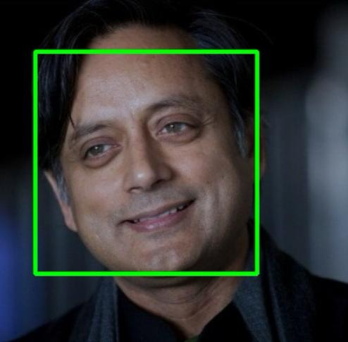
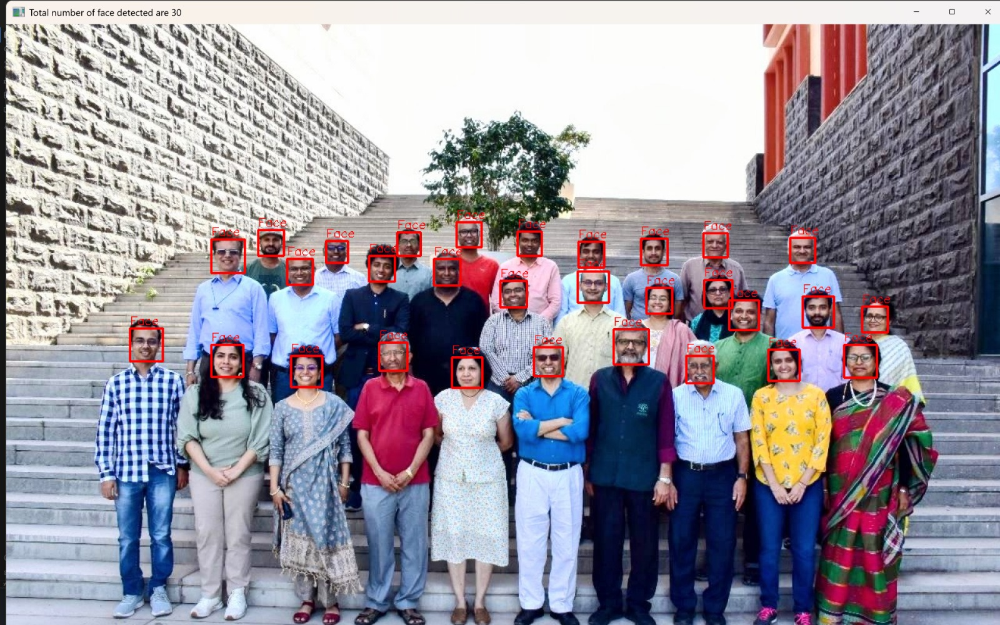
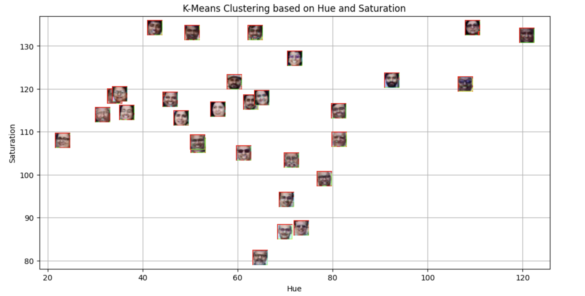
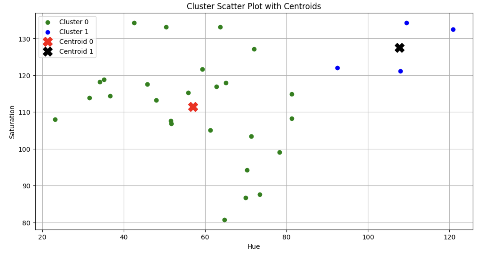
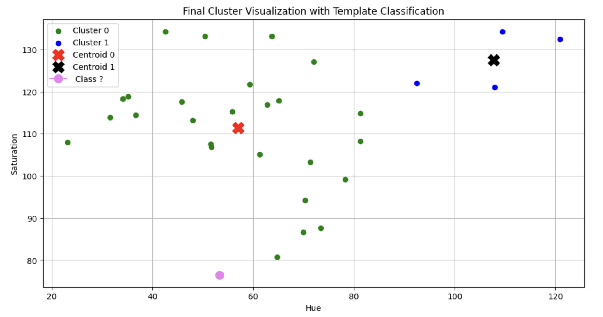
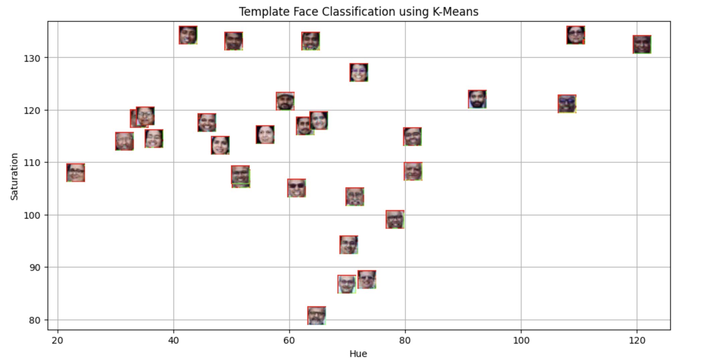

# MLPR Lab 5
Distance-Based Classification using K-Means

## Aim
The aim of this lab was to understand how distance-based classification works and how features like hue and saturation can be used to cluster and classify images using K-Means.

## Methodology
1. Detected faces using Haar Cascade.
2. Extracted hue and saturation values from each detected face.
3. Applied K-Means clustering on the extracted features.
4. Visualised the clusters.
5. Used a template image and predicted its cluster based on its distance from cluster centroids.

## Key Findings
- Faces can be grouped based on colour features.
- The template image was classified correctly by comparing its distance from cluster centroids.
- Feature selection significantly affects clustering results.

## Conclusion
This experiment helped me understand distance metrics, clustering, and classification in a practical way. It demonstrated how similarity between feature values can be effectively used for image-based classification.

## Visualisations

## Face Detection

## Number of Faces Detected

## Hue and Saturation Plot

## Cluster Scatter Plot

## Final Cluster Output

## Template Face Classification

